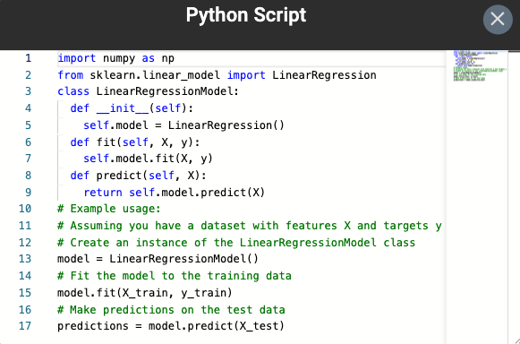
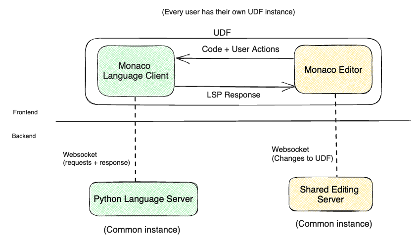
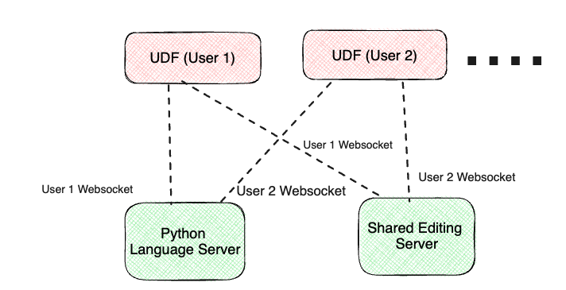
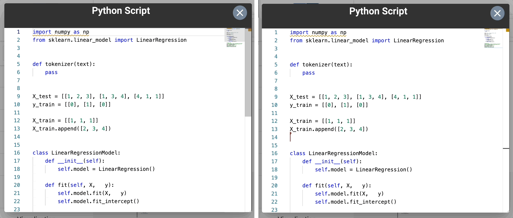
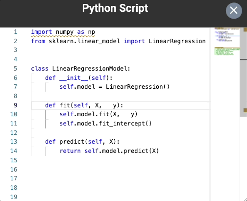
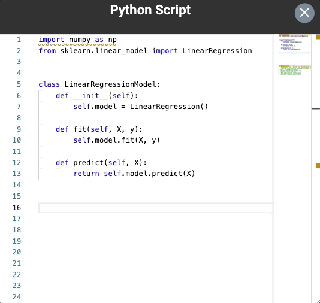
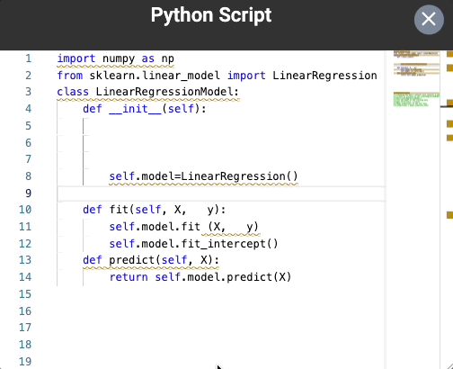
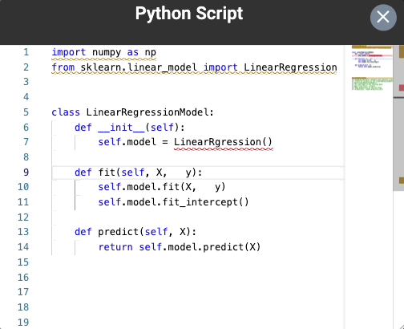
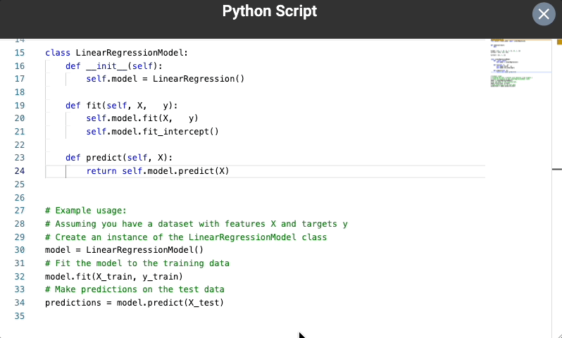

### Motivation

The user-defined function (UDF) operator in Texera plays an important role to allow developers to customize their workflows. The previous implementation of the code editor in the operator can only display the code as plain text (as shown in Figure 1), and it lacks many IDE-like features such as syntax checking and autocomplete. These limitations hinder the productivity of UDF developers. For instance, users often made syntax mistakes that were discovered only when they tried to execute the code. The absence of auto-completion and documentation-on-hover features created a cumbersome experience for the users, requiring them to switch back and forth between the code editor and external documentation websites.

In the literature, language servers are available to perform static syntax checks, provide intelligent code completion, offer on-the-fly error highlighting, and deliver rich documentation support. We plan to use this technique to address these limitations.

<figure align="center">
  
  <figcaption align = "center">
    <i>
      <b>Figure 1.</b> The old code editor which does not highlight errors, provide suggestions or any contextual information.
    </i>
  </figcaption>
</figure>

### Existing Solutions
In our search for a suitable solution, we carefully evaluated the available options on the market. Some options included code analysis libraries such as [Pygments](https://pygments.org/) for Python, language-specific tools such as the [Jedi library](https://jedi.readthedocs.io/en/latest/).
There were disadvantages of using libraries for our task as they have limited editor integrations, lack a standardized protocol, and do not provide advanced features. After a thorough evaluation, we chose the [Language Server Protocol](https://langserver.org/) (LSP), a communication channel between a client and a language smartness provider server. The decision to adopt LSP was driven by its status as an open standard and its widespread adoption by industry leaders such as Codenvy, Red Hat, and Sourcegraph. Moreover, LSP provides advanced Python developers with an IDE-like experience and offers excellent extensibility, making it a perfect fit for our requirements. In the subsequent sections, we will explore the integration of LSP and the significant advantages it brings to our UDF code editor.

### Challenges
We encountered two primary challenges:
- Integrating LSP with Texera’s existing architecture: The current Texera architecture relies on the robust [Monaco editor](https://github.com/microsoft/monaco-editor), a popular code editor used by millions of developers worldwide. It is important to ensure a smooth transition to LSP while preserving the functionality and familiarity of Monaco.
- Compatibility with the existing shared editing functionality: Texera’s UDF code editor supports collaborative editing (powered by [Yjs](https://github.com/yjs/yjs)), enabling multiple users to work simultaneously on the same UDF. Introducing LSP raised concerns about inadvertently propagating suggestions and pop-ups to other users who might be working on different sections or simply reading the code of the same UDF operator.

### Implementation
To address the challenges, we propose a new architecture of the UDF editor as shown in Figure 1.

<figure  align="center">
  
  <figcaption align = "center">
    <i>
      <b>Figure 2.</b> Architecture of connecting UDF editor with Language server.
    </i>
  </figcaption>
</figure>

The new architecture includes a Language Client and a Python Language Server that implements the LSP. The updated lifecycle is as follows:
- **User Interaction**: A user opens a UDF editor and performs actions such as typing new code, hovering over text, right-clicking to find references, or reading existing code, to trigger a user request.
- **Request Forwarding**: The language client receives these user requests and forwards them to the designated language server configured for the UDF Editor.
- **Request Processing**: The language server processes the received requests, performing tasks such as code analysis, resolving references, or generating suggestions.
- **Response Delivery**: The language server sends the processed responses to the language client.
- **Response Analysis and Rendering**: The language client analyzes the received responses and renders them within the UDF Editor, providing the user with relevant information, suggestions, or feedback.

This architecture allows shared editing to function seamlessly. The suggestions and pop-ups provided by the language servers were carefully scoped to the specific user's context. When new characters are added to a UDF Editor, two requests are created: one to the shared editing server and the other to the monaco language client. Every user has their own copy of the UDF editor. By extension the language client, the response from the python language server is sent to the origin and not to a different client. This design prevents inadvertently propagating suggestions and pop-ups to other users. This behavior is shown in the Figure 3:

<figure align="center">
  
  <figcaption align = "center">
    <i>
      <b>Figure 3.</b> Language server with shared editing.
    </i>
  </figcaption>
</figure>

Figure 4 shows how it works in action:
<figure>
  
  <figcaption align = "center">
    <i>
      <b>Figure 4.</b> Enhanced UDF Editor with shared-editing enabled.
    </i>
  </figcaption>
</figure>

### Supported Features
The full list of features supported by the Python language server can be found [here](https://github.com/palantir/python-language-server#language-server-features).
The changes introduced here were merged as part of this [pull request](https://github.com/Texera/texera/pull/1886).
The following are some examples in action in the UDF editor.

1. **Hover**: The feature displays contextual information, such as function signatures or variable details, when the user hovers the cursor over a specific piece of code.
<figure align="center">
  
  <figcaption align = "center">
    <i>
      <b>Figure 5.</b> Users can hover over different variables to view their documentations and contextual information.
    </i>
  </figcaption>
</figure>

2. **Auto Completion**: The feature suggests code completions as the user types, offering relevant function names, variable names, and other elements to enhance coding speed and accuracy.
<figure align="center">
  
  <figcaption align = "center">
    <i>
      <b>Figure 6.</b> The editor autocompletes the code while users are typing.
    </i>
  </figcaption>
</figure>

3. **Code Linting**:  The language server analyzes the Python code for potential errors, stylistic issues, or best practice violations, providing real-time feedback to help maintain code quality and consistency.
<figure align="center">
  
  <figcaption align = "center">
    <i>
      <b>Figure 7.</b> The editor reports linting errors and provides automatic fix.
    </i>
  </figcaption>
</figure>
<figure align="center">
  
  <figcaption align = "center">
    <i>
      <b>Figure 8.</b> The editor alerts for code errors and helps users to fix them.
    </i>
  </figcaption>
</figure>

4. **Go to Definition**: The feature allows users to quickly navigate to the exact location of a function, variable, or class declaration within the codebase, enhancing code exploration and understanding.
<figure align="center">
  
  <figcaption align = "center">
    <i>
      <b>Figure 9.</b> Users can jump to definition and occurrences of variables and functions.
    </i>
  </figcaption>
</figure>

### Future Improvement

Texera's evolution to a powerful project comes with the promise of embracing new programming languages, such as R or Scala, to meet the diverse needs of users. The groundwork laid for the Python language server paves the way for easy integration of language servers for these additional languages. By editing the configuration file, we can seamlessly introduce new language servers into Texera. The configuration file acts as a guiding map, allowing us to specify the necessary details for connecting to a new language server's websocket.

### Summary
In this blog, we shared how we used the language server protocol to enhance the user experience of the UDF editor in Texera.

#### Acknowledgements
Thanks to Yicong Huang, Prof. Chen Li, and the Texera team, for their help in the project and this blog.
