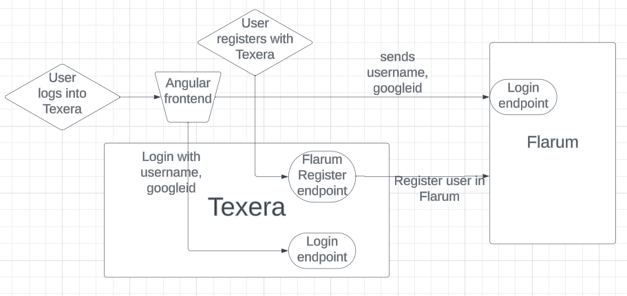
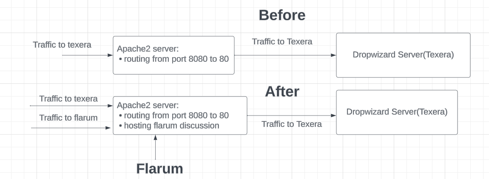

In this blog, we discuss how we support a online discussion forum in Texera using Flarum.

## Motivation

As a platform to support collaborative data science, Texera needs an online forum that allows users to post issues, help each other, and discover new topics. We implemented this feature using Flarum, one of the popular open-source solutions available on GitHub. Supported and maintained by a large community of developers, Flarum has been well received due to its modern design, user-friendly interface, and minimal core with high extensibility.

## Challenges

There were two main challenges:

- The user management and authentication of Flarum need to be synchronized with the counterparts of Texera. In particular:
  - When a user logs into Texera, they should be be able to make posts in the discussion forum under that account
  - When a new user registers in Texera and logs in, the forum needs to recognize that and allow the user to make posts under that account
  - A user can only access the forum after logging into Texera. If the user is deleted, they should not be able to access the forum.
- Server of Flarum:
  - Written in PHP and Javascript (with Typescript), Flarum can only be hosted on Apache2 (httpd) or nginx. Texera is hosted on Dropwizard in a production environment. Introducing a new web server adds complexity to the system.

## Solution

- We support the synchronization of the user information between the main Texera system and the Flarum system, including account creation and authentication.
- We chose Apache2 server to host the Flarum discussion forum.
- We wrote scripts to support auto setup of the forum on Windows, Mac OS, and Ubuntu for deployment.

### 1. **User Autoauthentication**:

Flarum runs as a microservice separately from the main parts of Texera. It provides several endpoints to support consistency between the users in Flarum and the main Texera.

  <figure align="center" style="width: 100%; max-width: none;">
  
  <figcaption align="center" style="font-size: 1.2em;">
    <i>
      <b>Figure 1.</b> When a user logs into Texera, the angular frontend calls the login endpoints of Texera and Flarum separately to ensure users are logged in on both sides. When a user registers in Texera, Texera adds the user in Flarum as well.
    </i>
  </figcaption>
</figure>

### 2. **Server of Flarum**:

<figure align="center" style="width: 100%; max-width: none;">
  
  <figcaption align = "center" style="font-size: 1.2em;">
    <i>
      <b>Figure 2.</b> We run flarum on the proxy server. 
    </i>
  </figcaption>
</figure>

### 3. **Installation scripts**:

We wrote bash and powershell scripts to automatically install and configure Flarum to do the following:
  <ul>
    <li>install Apache2, PHP, and composer (the package manager for PHP)</li>
    <li>create a Flarum directory with composer and provide configurations for Flarum</li>
    <li>set up the MySQL database for Flarum</li>
    <li>configure the apache2 server</li>
    <li>restart the server to run the Flarum application</li>
  </ul>

## Features

The discussion forum includes the following features:

- Flarum built-in Features:

  - post creation:
    - Users can create discussions with tags, create posts within discussions, and reply to posts
  - Search:
    - Users can search in discussions
    - A drop-down menu displays options for sorting discussions (e.g., latest, oldest, popular)
  - Admin:
    - Admins can toggle on and off different extensions
    - Admins can assign privileges to different groups and users
    - Admins can change settings for the whole forum
  - Users can "like" posts and see how many likes a post receives

- New features implemented by us:
  - Auto-authentication: When a user logs into Texera, the same user will be logged in automatically in the discussion forum as well
  - Auto-account synchronization: When a new user registers and logs into Texera, the same new user account will appear in the discussion forum

Extensions:

- fof/byobu (private discussions): Certain users with privileges can create private discussions that are only visible to a selected group of users
- michaelbelgium/flarum-discussion-views: Users can see the view count and post count of every discussion.

## Demonstrations

### 1. **User Autoauthentication**:

As shown below, when a user logs into Texera, the user will also log in on the discussion forum site.

  <figure align="center" style="width: 100%; max-width: none;">
  
  <figcaption align = "center" style="font-size:1.2em;">
    <i>
      <b>Figure 3.</b> user logs into Texera.
    </i>
  </figcaption>
</figure>

### 2. **Create a discussion, make posts, and reply to posts**:

The following image shows how a discussion/post is created here. Users can add tags to a post, such as "General."

<figure align="center" style="width: 100%; max-width: none;">
  
  <figcaption align = "center" style="font-size:1.2em;">
      <b>Figure 4.</b> A user creates a dicussion and publishes the first post.
    </i>
  </figcaption>
</figure>

<figure align="center" style="width: 100%; max-width: none;">
  
  <figcaption align = "center" style="font-size:1.2em;">
    <i>
      <b>Figure 5.</b> A reply button under each post 
    </i>
  </figcaption>
</figure>

<figure align="center" style="width: 100%; max-width: none;">
  
  <figcaption align = "center" style="font-size:1.2em;">
    <i>
      <b>Figure 6.</b> The composer view of the reply
    </i>
  </figcaption>
</figure>

### 3. **Create a private discussion**:

Users with certain privileges can create private discussions that are only visible to a selected group of users

<figure align="center" style="width: 100%; max-width: none;">
  
  <figcaption align = "center" style="font-size:1.2em;">
    <i>
      <b>Figure 7.</b> A user creates a private discussion under a separate tab and chooses the users/groups for this discussion
    </i>
  </figcaption>
</figure>

### 4. **Admin features**:

The discussion feature of Texera can be managed and maintained through the Flarum forum admin page. An admin has various privileges, such as managing user accounts, management of extensions, and giving privileges to users.

<figure align="center" style="width: 100%; max-width: none;">
  
  <figcaption align = "center" style="font-size:1.2em;">
    <i>
      <b>Figure 8.</b> 
    </i>
  </figcaption>
</figure>

### 5. **View and reply count**:

<figure align="center" style="width: 100%; max-width: none;">
  
  <figcaption align = "center" style="font-size:1.2em;">
    <i>
      <b>Figure 9.</b> The number of views and replies for each dicussion
    </i>
  </figcaption>
</figure>

### 6.**Other features**:

<figure align="center" style="width: 100%; max-width: none;">
    
  
  <figcaption align = "center" style="font-size:1.2em;">
    <i>
      <b>Figure 10.</b> Full-text search allows users to search relevant posts
    </i>
  </figcaption>
</figure>

<figure align="center" style="width: 50%; max-width: none;">
  
  <figcaption align = "center" style="font-size:1.2em;">
    <i>
      <b>Figure 11.</b> Search results sorted based on different options
    </i>
  </figcaption>
</figure>

## Future improvement to support 'Mentions':

When a user types in the "AT" character (@), we want to automatically show related resources such as users, workflows, projects, data sets, etc. We call this feature "mentions." There is a "mentions" extension already included when we use composer to create the Flarum directory, which can do the following:

- mentioning of users and groups
- mentioning of posts used in post replies

We will use this extension to implement the feature. One challenge is related to how to synchronize the resources in the MySQL database of Texera and the MySQL database of Flarum.
