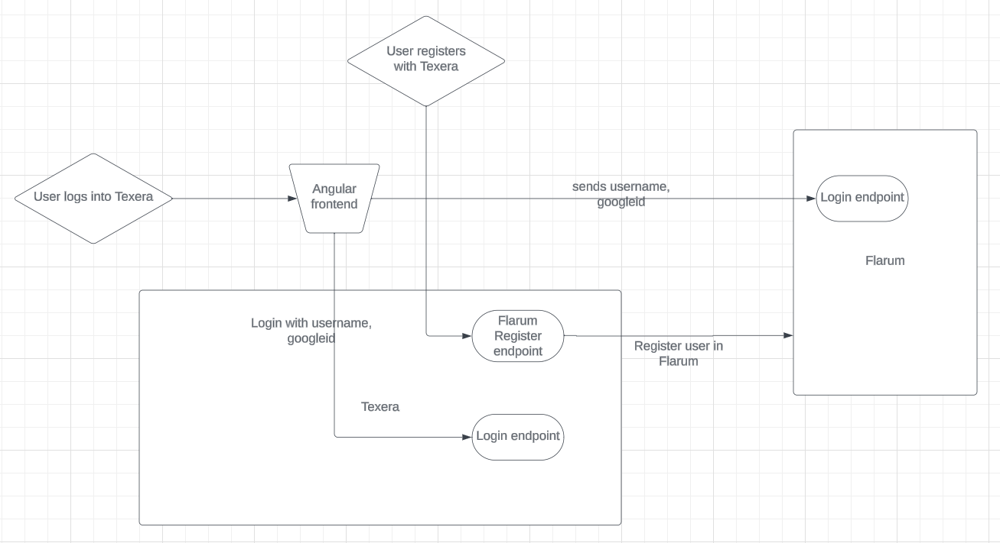
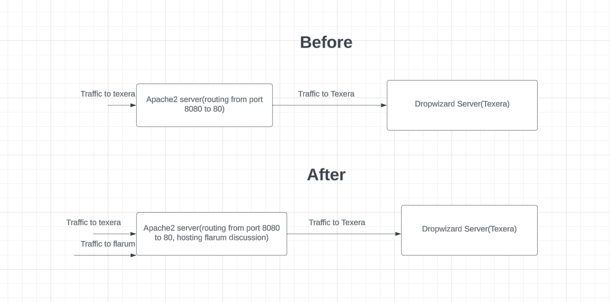
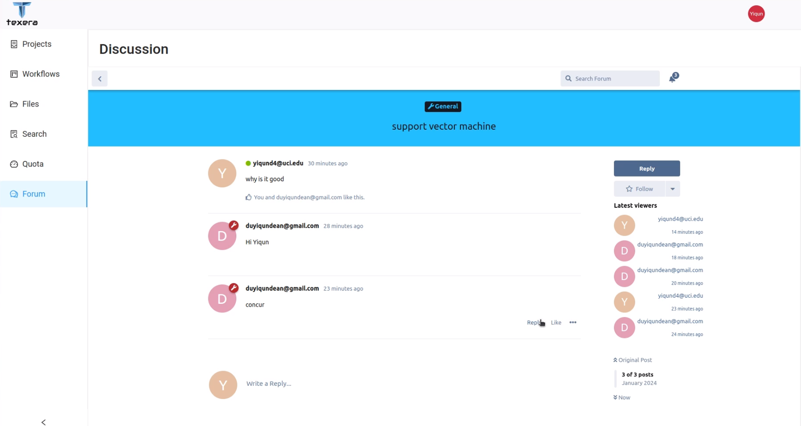
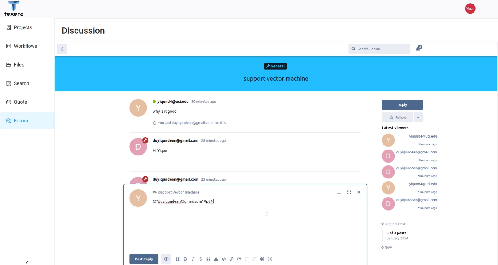
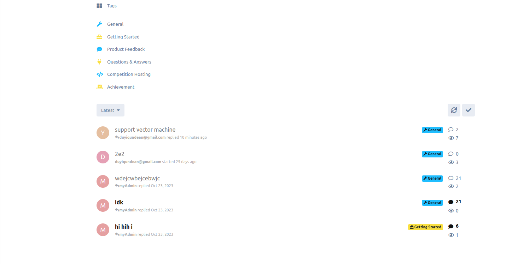

In this blog, we discuss how we seemlessly integrated the forum feature into texera through synchronizing user accounts, user sessions, the features that flarum support, and how we developed scripts for the deployment of this feature in production as well as for development.

### Motivation

Being a shared editing machine learning workflow platform that emphasizes on collaboration, allowing discussions through forum between users will be very beneficial. Users can thus post issues, help each other to solve those issues as well as discovering new topics in the field of Data Science.

The Flarum Software has been the most popular open source forum software available in Github. Having been supported and maintained by a large active community of developers, Flarum has been well received by its modern design, user-friendly interface, minimal core with high extensibility, which is why we opted to choose this software as our forum software.

### Challenges

We encountered two primary challenges:

- The user system and authentication system of dicussion forum (flarum) needs to be sychronized with other parts of Texera so that the whole systems remain consistent, which means:
  - when a user logs into Texera, they can start making posts in discussion forum under that account
  - When a new user register with Texera and log in, the forum needs to recognize that and allow the user to make posts under that account
  - a user can only access the forum after logging into Texera. If the user is deleted or banned, they should not be able to access the forum at all.
- Where to run flarum:
  - Written in PHP and Javascript(some Typescript), The flarum software can only be hosted on either Apache2(httpd) or nginx. Texera is mainly hosted on dropwizard. Adding an additional server can add complexity in terms of further maintaining and managing the system.

### Our Implementation

#### Overview

- Our effort ensured the sychroniztion of the user system including account creation and authentication.
- Apache2 server was chosen to host out flarum discussion forum.
- Scripts were written to enable auto setup of forum on Windows, Mac OS as well as Ubuntu for deployment and development purposes.

1. **User Autoauthentication**:
  <figure align="center">
  
  <figcaption align = "center">
    <i>
      <b>Figure 1.</b> user logs into Texera.
    </i>
  </figcaption>
</figure>

2. **Where to run flarum**:
<figure align="center">
  
  <figcaption align = "center">
    <i>
      <b>Figure 2.</b> 
    </i>
  </figcaption>
</figure>

### Demonstration of dicussion features

#### Overview

- The Flarum Dicussion forum includes these following features to support our online discussion
  - Features implemented by us:
    - Auto-authentication: When the user logs in to Texera, the same user will be logged in automatically in discussion forum as well
    - Auto-account synchroniztion: When a new user registers and logs into Texera, the new user account will appear in discussion forum
  - Flarum built in Features:
    - post creation:
      - Users can create dicussions with different tags, create posts with in discussions and reply to posts
    - Search:
      - A robust search feature to search for dicussions
      - A dropdown menu displaying options for sorting discussions(latest,oldest, popular)
    - Admin:
      - Admins can toggle on and off different extensions
      - Admins can assign privileges to different groups and users such as starting a discussion, delete posts, flag posts and so on
      - Admins can change some settings for the whole
- Others: - Users can like posts, and see how many likes a post receive
  - Flarum features from extensions: Flarum's minimal core with high extensibility design allows for extensions to be developed to support some custom features, we found the following to be useful to our platform:
    - fof/byobu(private discussions):
      - Users with given privileges can create private discussions that only visible a selected group of users
    - michaelbelgium/flarum-discussion-views:
      - Users can see the view count and posts count of every discussion.

## Demonstrations

1. **User Autoauthentication**: as shown below, when user logs into Texera, user will also appear logged in on the dicussion forum site, thus providing a smooth user experience and making the forum more integrated with other parts of the site.
  <figure align="center">
  
  <figcaption align = "center">
    <i>
      <b>Figure 3.</b> user logs into Texera.
    </i>
  </figcaption>
</figure>

2. **Create a dicussion, Make basic posts,Reply to posts**: Here shows how a typical discussion/post is created. Everytime the user creates a dicussion, they can put it under different tags such as "general".
<figure align="center">
  
  <figcaption align = "center">
    <i>
      <b>Figure 4.</b> User creates a dicussion and publishes the first post.
    </i>
  </figcaption>
</figure>

<figure align="center">
  
  <figcaption align = "center">
    <i>
      <b>Figure 5.</b> a reply button under each posts for other users to reply to 
    </i>
  </figcaption>
</figure>
<figure align="center">
  
  <figcaption align = "center">
    <i>
      <b>Figure 6.</b> the composer view of the reply
    </i>
  </figcaption>
</figure>

3. **Create a private dicussion**: Users with given privileges can create private discussions that only visible to a selected group of users
<figure align="center">
  
  <figcaption align = "center">
    <i>
      <b>Figure 7.</b> user creates a privite dicussion under a different tab, chooses the users/groups that this discussion can be visible to
    </i>
  </figcaption>
</figure>

4. **Admin features**: The dicussion feature of texera can be managed and maintained through the flarum forum admin page.Admin has various privileges over giving privileges to users, managing user accounts, the visuals of the discussion, and managing extensions.
<figure align="center">
  
  <figcaption align = "center">
    <i>
      <b>Figure 8.</b> 
    </i>
  </figcaption>
</figure>

5. **View and reply count**:
<figure align="center">
  
  <figcaption align = "center">
    <i>
      <b>Figure 9.</b> the number of views and replies for each dicussion is displayed
    </i>
  </figcaption>
</figure>

6.**Other features**:

### Furture efforts
