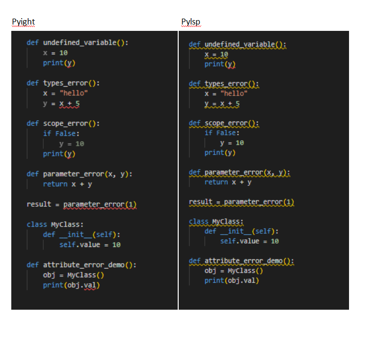
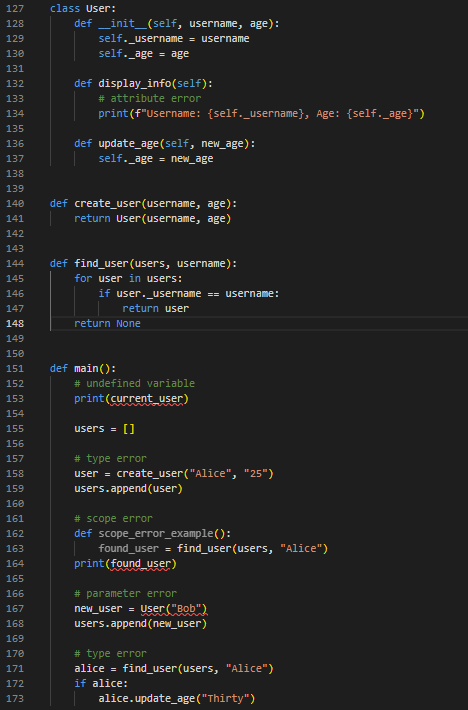
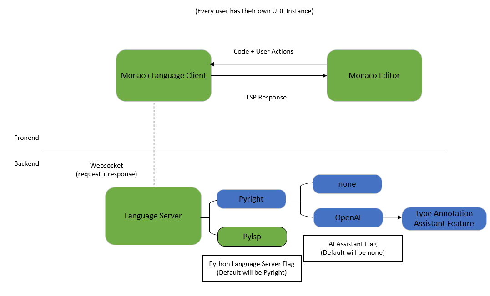
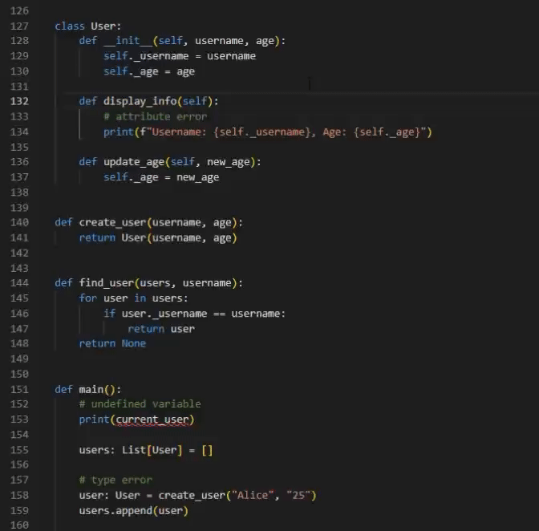
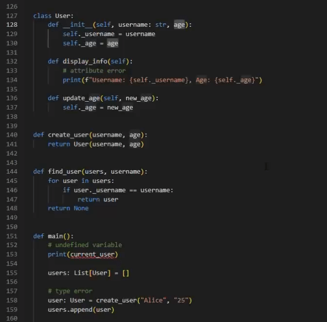
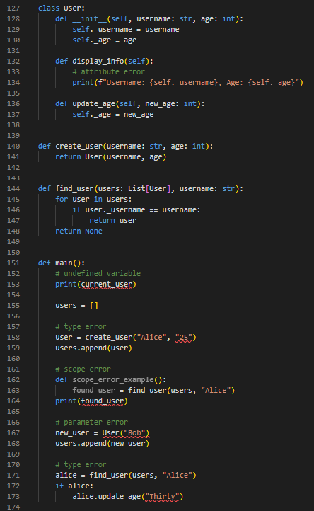

## Motivation

The User-Defined Function (UDF) operators in Texera are crucial for allowing developers to customize their workflows. To improve the development experience, we need a python language server that can detect both syntax and semantic errors early in the coding process.

Previously, we relied on the Pylsp for basic language server functions, including syntax checks and code completion. However, Pylsp had difficulty on detecting more complex semantic errors in user code, particularly with type mismatches. To enhance the user experience and provide more accurate error feedback on such semantic issues, we choose Pyright— a python language server with more powerful static type checking capabilities. Pyright helps developers write more robust and maintainable code by catching issues such as type mismatches, significantly reducing debugging time.

<figure align="center">
  
  <figcaption align = "center">
    <i>
      <b>Figure 1.</b> Comparing the Performance of the Two Language Servers on Basic Semantic Errors.
    </i>
  </figcaption>
</figure>

Figure 1 shows a comparison between two language servers on the same code. The yellow lines represent warnings, and the red lines represent errors.  Pylsp can recommend fixes with formatting suggestions from  [PEP 8 style guide](https://peps.python.org/pep-0008/#style-guide), such as the [two blank line requirement](https://peps.python.org/pep-0008/#blank-lines) between functions. It is limited to formatting warnings, instead of code correctness. As shown in the figure, Pylsp has only one red line, indicating that it detected only one semantic error. In contrast, Pyright correctly identified all errors, reflected by the additional red lines. For example, there is a type error in the second `def` block where `y = x + 5` and `x` is a string. This leads to a semantic error, as we cannot add a string and an integer. This demonstrates Pyright’s superior ability to detect semantic errors, making it a better choice for enhancing the UDF code editor.

## Challenge: Type Inference Without Type Annotations
A main limitation of Pyright is that it relies on the presence of type annotations for accurate semantic error detection. Many Python programs, especially those used in Texera Python UDFs, may not have type annotations, leading to reduced accuracy of the language server in detecting correct annotations. Therefore, the absence of accurate error detection could compromise code quality and user experience.

<figure align="center">
  
  <figcaption align = "center">
    <i>
      <b>Figure 2.</b> Semantic error detection of Pyright language server without type annotation.
    </i>
  </figcaption>
</figure>

As we can see, there are some semantic errors that Pyright is unable to detect due to lack of type annotations. In line 158, the `create_user` function should accept a string and an integer (here we suppose the user wants the `age` argument as an integer. The specific type needs to be determined based on the user's requirements), but the developer is calling this function with two strings. In line 173, the `update_age` function should accept an integer, but the developer is calling this function with a string as an argument. We will compare Pyright's capability in detecting semantic errors on the same code after our solution being applied.

## Solution
**Type Annotation with LLM**

To tackle the challenge of handling code without type annotations, we integrated a Large Language Models (LLM) into the UDF editor. This integration enables the LLM to automatically suggest type annotations, thereby enhancing the effectiveness of Pyright's static analysis. The LLM generate type annotation suggestions based on the context of the code. Users need to decide whether to accept the suggestion, and if they do, the suggestion will be added after the argument.

We developed a backend RESTful API that interacts with OpenAI's GPT-4 API to generate type annotation suggestions. Here are some key aspects of our implementation:

1. **API Design**: Our API integrates AI-assisted type annotations into the Texera UDF editor. The frontend Angular service, `AIAssistantService`, provides a method to request type annotations for the given code snippet. It communicates with a backend Scala service, `AIAssistantResource`, which handles authentication, processes requests, and interacts with the OpenAI GPT-4 API. The backend formats the code context into a specific prompt structure, sends it to OpenAI's chat completions API, and returns the suggested type annotations to the frontend. This design ensures secure, efficient communication between the user interface, the server, and the AI model.
2. **Prompt Engineering**: We experimented with various prompts to optimize the LLM's performance. In the beginning, we simply asked it to provide type annotations for arguments, but we found that it often responded with explanations that were needed, which would cause errors if they inserted into the code. So we defined its task strictly to return in the form of `: type suggestion`, and  provided several different examples for the LLM to learn from to ensure it strictly follows our requirements.
3. **Prompt Effectiveness**: We found that prompts providing more context about the function's purpose and usage led to more accurate type suggestions. After testing, we found that most of the time, it can provide satisfactory results, but occasionally, unsatisfactory suggestions may occur. Therefore, users still need to provide input to decide whether to accept or reject the type suggestion.

<figure align="center">
  
  <figcaption align = "center">
    <i>
      <b>Figure 3.</b> The type suggestion UI for either accept or decline.
    </i>
  </figcaption>
</figure>

This approach not only improves the accuracy of semantic error detection but also streamlines the development process by reducing the need for manual type annotations.

## Architecture overview
Figure 2 provides an overview of the architecture. The previously deployed components with Pylsp are shown in green, and the blue components are newly added. Two AI features have been introduced to enhance the performance of the Pyright language server.

<figure align="center">
  
  <figcaption align = "center">
    <i>
      <b>Figure 4.</b> New architecture of connecting UDF editor with Language server.
    </i>
  </figcaption>
</figure>

## Supported features
For basic language server features, including mouse hover, auto-completion, code linting, and going to definition, Pyright and Pylsp exhibit identical behaviors. You can refer to the old blog for specific demonstrations: [Enhancing the UDF Editor by Adding Language Server Support](https://texera.github.io/blog/enhancing-the-udf-editor-by-adding-language-server-support/#challenges). Here, we will focus on how to use the two newly added AI features and whether these features can improve Pyright's ability to detect semantic errors.

1. **"Add Type Annotation" Button**: The feature gives a type suggestion of a single argument selected by the user. The users can interact with the UI and choose to accept or decline the suggestion. If the suggestion is accepted, it will be added as a type annotation in the correct location of the code; otherwise, the suggestion is ignored and the code and the code is not modified.

<figure align="center">
  
  <figcaption align="center">
    <i>
      <b>Figure 5.</b> Examples of using "Add Type Annotation" button.
    </i>
  </figcaption>
</figure>

2. **"Add All Type Annotations" Button**: To accommodate the diverse needs of users, we offer a one-click feature designed to simplify the process. This feature gives type suggestions for all the arguments within the user-selected code. In this code snippet, each argument that requires a type annotation will be highlighted, allowing the user to accept or decline each suggestion separately. By streamlining the process of identifying and annotating arguments, this feature significantly enhances convenience and reduces manual effort.

<figure align="center">
  
  <figcaption align="center">
    <i>
      <b>Figure 6.</b> Examples of using "Add All Type Annotation" button.
    </i>
  </figcaption>
</figure>

## Empowering Pyright with Inferred Type Annotations
With all type annotations in place, users can fully enjoy Pyright's powerful semantic type detection capabilities. As shown in the image below, compared to Figure 3, all semantic errors have been correctly identified by the Pyright language server.

<figure align="center">
  
  <figcaption align="center">
    <i>
      <b>Figure 7.</b> Two more type errors are being detected after the type annotation being added.
    </i>
  </figcaption>
</figure>

## Limitation
AI can make mistakes in some cases. Therefore, users cannot completely rely on the type suggestions returned by the LLM, which are merely suggestions. Users need to evaluate whether each suggestion is correct and maked a careful choice to accept or decline it.

## Summary
In this blog, we showcased how we integrated the LLM with the Pyright language server to enhance the user experience of editing UDFs in Texera.

## Acknowledgements
Thanks to PhD Student Yicong Huang, Prof. Chen Li, and the Texera team for their help in the project.
