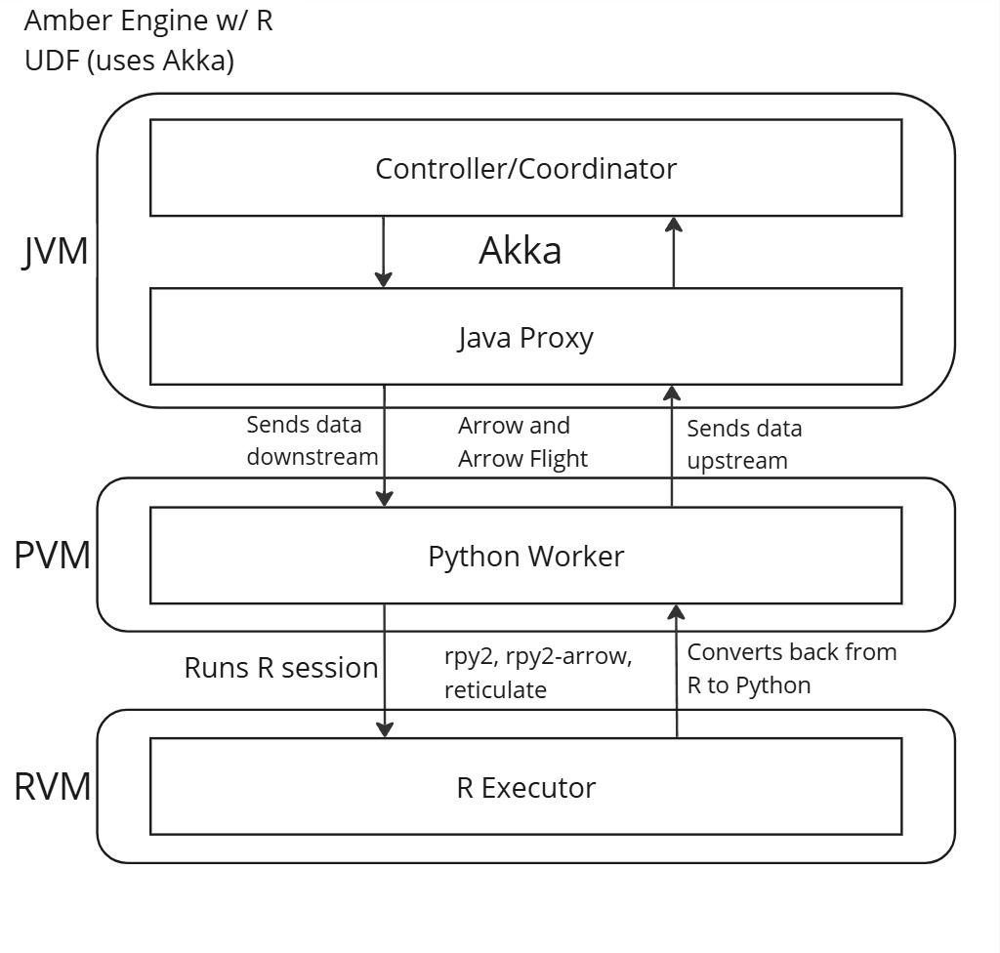
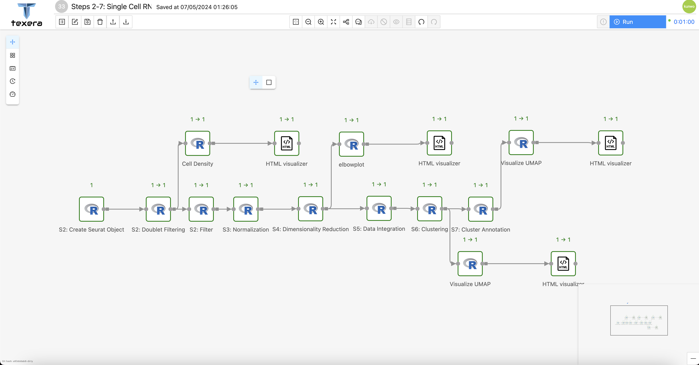

## Motivation

The R programming language is widely used in many fields, such as bioinformatics, statistical analysis, and social science. Its popularity is driven by its capabilities and the growing demand for data-related work. Given its significance, our goal was to allow users to seamlessly integrate R into Texera workflows.

We want to enhance Texera by extending its support to include R code and facilitating the creation of R user-defined functions (UDFs) for both the table and tuple APIs. Doing so would mirror the functionality of Python UDFs, allowing both experienced and new users of Texera to leverage R in their work.

## Challenges
The current support for R UDF in Texera utilizes Python User-Defined Functions and `rpy2` (a Python library to use R in Python) to incorporate R code. However, this approach has two limitations, compatability and performance.

### Challenge 1: Compatibility
The first challenge we faced was compatibility issues between R and Python. While `rpy2` is used to call R from Python, some R packages also internally call Python (e.g. `reticulate`), causing compatability issues between the two systems. Therefore, we have to make sure any compatability issues were resolved.

### Challenge 2: Performance

The second challenge we faced was performance issues in the previous design. Data in Texera travels down from Java to Python to R and then back up in the opposite direction. In the old design, multiple rounds of serialization, deserialization, and copy operations were done on the same data, creating significant overhead. We wanted to eliminate this as much as possible in our new design.

## Initial Design
### Arrow Flight and the Flight Server-Client Model

Our original objective was to employ [Arrow’s Flight module](https://arrow.apache.org/docs/format/Flight.html) in order to develop a native [R Flight client-server model](https://github.com/apache/arrow/blob/main/r/R/flight.R). The implementation of such a model presents several advantages, paramount among them being the standardization of frameworks for both R UDF and Python UDF. Notably, the Python UDF framework already utilizes its exclusive Arrow Flight client-server model. Adopting a similar approach in R would streamline maintenance and future development. Moreover, Arrow Flight's in-memory data-transfer capabilities significantly enhance performance, facilitating rapid operations within data-intensive workflows.

However, we discovered the following from the [R Arrow Flight documentation](https://arrow.apache.org/docs/r/articles/flight.html):
>"At present the arrow package in R does not supply an independent implementation of Arrow Flight..."

Instead, R Arrow Flight operates by invoking methods from the PyArrow Python package, including the code for running a Flight server in R. The most critical issue with this realization is because we wanted R UDF to be executed on the Flight server side. Due to the lack of a native R Flight server, this goal no longer was feasible.

Regrettably, as of July 14, 2024, there was still no independent implementation of Arrow Flight. Currently, the R Arrow developers have no immediate plans to do so as well, as shown in their biweekly [meeting notes](https://docs.google.com/document/d/1nSIfJw8mfqtvScqvSVqmktpWff80pFmkqiZT7nTtiDo/edit#heading=h.k1ts4kvvl8jq). Consequently, we had to devise an alternative solution for R UDF that leverages Arrow and `rpy2` alone, eschewing Arrow Flight.

## Our Proposed Design

Our proposed architecture features a three-layered design, where the data flows from Java to Python, then to R, before returning back to Python and Java. An  illustration of this architecture is in *Figure 1* below.

<figure align="center" style="width: 100%; max-width: none;">
   
   <figcaption align = "center" style="font-size:1.2em;">
      <i>
      <b>Figure 1.</b> A concise overview of our proposed design for R UDF.
      </i>
   </figcaption>
</figure>


The core of the design for R UDF relies predominantly on `rpy2` and `rpy2-arrow`, with both playing an essential role in ensuring smooth and consistent conversions between Python and R. In this architecture, the Python Worker uses `rpy2` to run an embedded R session. Data sent downstream from the JVM to Python is then transfered to R using `rpy2` and `rpy2-arrow`.

After the R Executor finishes running, both `rpy2` and `rpy2-arrow` convert the returned values from R back to Python. The Python Worker then processes the returned data as necessary and transmits it back upstream to the JVM.

### Solving Challenge 1: Compatibility

As mentioned previously, R and Python had compatabilility issues stemming from the fact that they were able to portions of each other at the same time. The biggest example of this issue pertained to the concurrent use of `reticulate` (an R package to use Python within R) and `rpy2`. In 2018, an issue was reported on GitHub highlighting a compatibility problem when using both libraries simultaneously.

The primary issue was from conflicting lock files between Python and R threads, causing deadlocks as either `reticulate` or `rpy2` would lock either the session of Python or R, preventing the other from accessing it. We were pleased to discover that this issue was resolved in 2022, allowing the concurrent use of `rpy2` and `reticulate`. Further details can be found [here](https://github.com/rstudio/reticulate/issues/208).

Additionally, we realized that each block of R code executed through `rpy2` ran in its own miniature, containerized environment. This isolation helped to avoid compatibility issues with libraries, particularly when testing workflows with multiple R UDF operators, each having its own separate R environment.

### Solving Challenge 2: Performance

To address performance issues, we needed an effective method to bridge `R`, `Arrow`, and `Python` together. We found that the [`rpy2-arrow`](https://github.com/rpy2/rpy2-arrow) library, developed around 2020, functioned well for our purposes.

A significant advantage of `rpy2-arrow` is its adaptation of the Arrow RPC framework, which enables in-memory operations on Arrow data. Furthermore, `rpy2-arrow` achieves maximum efficiency by using pointers extensively, encouraging use of zero-copy operations. These advantages greatly reduce data transfer overhead between different langauge environments.

`rpy2-arrow` is also an extension of the `rpy2` library, providing smooth usage when used together.

### A Demo Workflow of R UDFs
As a showcase of the successes of our proposed design, below in *Figure 2* is a sample workflow created by one of our users that exclusively uses R UDFs, all of which employed the tuple API.

<figure align="center" style="width: 100%; max-width: none;">
   
   <figcaption align = "center" style="font-size:1.2em;">
      <i>
      <b>Figure 2.</b> A sample workflow using R UDFs only. All of the operators are using the tuple API.
      </i>
   </figcaption>
</figure>

This demo workflow was used in a research project intended to conduct Single Cell RNA analysis with R. The main driver for conducting the analysis came from the [`Seurat`](https://satijalab.org/seurat/) package, which contains the eponymous `Seurat` object, an object that can store extensive data about single cells. In this workflow, the created `Seurat` object was frequently used as both input and output. Each step in the workflow utilized R UDFs to modify, extract, or inspect the `Seurat` object in some way, as can be seen from the labeled steps assigned to each R UDF operator.

Moreover, the branching sections of the workflow featured visual aids extracted from the `Seurat` object as output. These visualizations were then promptly embedded in HTML code created by their preceeding R UDF operators.

## Supported R UDF APIs

### Tuple API
#### What is R UDF Tuple API?
The tuple API allows R code to process and return individual tuples one at a time, making it especially useful for stream-like data interfaces.

#### How does R UDF Tuple API Work?

The goal of the tuple API is to enable users to write an R generator that yields an R `Tuple` or any structure convertible to an R `Tuple`. This is done through R's `coro` package, which supports writing Python-like generators in R. The written generator receives two arguments: the `tuple` itself and the `port`. Currently, the `port` argument is unused but may be utilized in the future. Lastly, users can also yield zero, one, or multiple tuples.

In the backend engine, the returned R `Tuple` is converted into a Python `Tuple`, with automatic type conversion and serialization from R to Python. When the next operator receives the `Tuple`, it is split into two subsequent `Tuples`: one containing non-binary data and the other containing binary data. The non-binary `Tuple` is converted into an Arrow `StructArray`, leveraging Arrow's advantages. The binary tuple undergoes manual deserialization to retrieve the original object(s). Finally, both `Tuples` are combined and passed into the R UDF as an argument. Note that for each `Tuple`, we only use one serialization and deserialization operation, thereby improving performance.

#### When should R UDF Tuple API be used?

Users should employ the tuple API when they need to process, modify, or inspect data in individual units. Another suitable use case is when users want to quickly process data without waiting for an entire chunk as required by the table API.

#### Tuple API: Example Code

Below is a simple example of using the tuple API in an R UDF. This scenario demonstrates how to yield five `Tuples` each containing a string, integer, and boolean component from the source. Then, for each `Tuple`, we can yield five additional `Tuples` after modifying each Tuple's integer component.

##### Source R UDF Tuple Operator

Here, the user writes R code to yield a `List` with three attributes: `int_attr`, `str_attr`, and `bool_attr`. Note that since R does not natively support generators, we import the `coro` package. The body for the `function()` part of the code must be an anonymous function (similar to a Python lambda function).

```R
library(coro)

coro::generator(function() {
    for (i in 1:5) {
        tuple <- list(
            int_attr = 1L,  # R integer
            str_attr = "A", # R string
            bool_attr = TRUE # R logical (boolean)
        )
        yield(tuple)
    }
})
```

Next, the user writes a function to increment the `int_attr` component of the `Tuple` by the index taken from a for loop. In this case, we can yield five separate `Tuples`, all of which modify the original `Tuple`.  Again, the body of `function(tuple, port)` must be an anonymous function.
```R
library(coro)

coro::generator(function(tuple, port) {
    for (i in 1:5) {
        new_tuple <- tuple
        new_tuple$int_attr <- new_tuple$int_attr + i
        yield (new_tuple)
    }
})
```

### Table API
#### What is R UDF Table API?
The Table API allows R code to process and return entire tables in a single operation. This functionality is particularly beneficial when dealing with large chunks of data that need to be processed or modified in bulk.

#### How does R UDF Table API Work?
The objective of the table API is for the user to write an R function that returns an R `data.frame` or any structure convertible to a `data.frame` in R, such as an R `list`, `matrix`, or `vector`. The provided function should accept two arguments: the `table` itself and the `port`. Currently, the `port` argument is unused but may be utilized in the future.

In the engine's backend, the returned R `data.frame` is converted into an PyArrow `Table` using `rpy2-arrow`, facilitating seamless data transfer to the next operator.

#### When should R UDF Table API be used?
Users should employ the table API when they need to process or pass along bulk data in large, tabular chunks. Another suitable use case for the table API is when users need to modify an entire `Table` and return the entire modified result.

#### Table API: Example Code

Below is an example of simple usage of the table API in an R UDF. In this scenario, we aim to return a simple table from R containing three attributes and three rows of data. We then add a new row, resulting in a total of four rows of data.

The Source R UDF Table Operator example is as follows. Here, the user writes R code to return a `data.frame` with three attributes: `Training`, `Pulse`, and `Stamina`:

```R
function() {
    table <- data.frame(
        Training = c("Strength", "Stamina", "Other"),
        Pulse = c(100L, 150L, 120L),
        Duration = c(60, 30, 45)
    )

    return(table)
}
```
Next, in the R UDF Table Operator, the user writes a function to add a new row to the source Table:
```R
function(table, port) {
    # Note that the port argument is unused, this is intentional for now
    new_row <- data.frame(
        Training = "TEST",
        Pulse = 123L,
        Duration = 999
    )

    table <- rbind(table, new_row)
    return(table)
}
```
The final table will now contain a total of four rows.

In the final tuple, the `int_attr` will be incremented from 1 to 2.

## Conclusion
The introduction of R UDF support in Texera marks a significant milestone, opening up new opportunities and use cases for the platform. This development paves the way for a broader range of users and applications, enriching the Texera ecosystem.

We hope that this work and insights serve as a solid foundation for further enhancements by other developers. It is our hope that future improvements will continue to be built on top of this foundation, expanding Texera's capabilities.

## Acknowledgements
We want to credit Prof. Chen Li for guiding us throughout this journey, Kun Woo (Chris) Park for being a user of R UDF, Cornell colleagues Prof. Shuibing Chen, Sally Lee, Dongliang Leng, for providing single-cell analysis R programs converted to the workflow in *Figure 2*, and the entire Texera Team.
