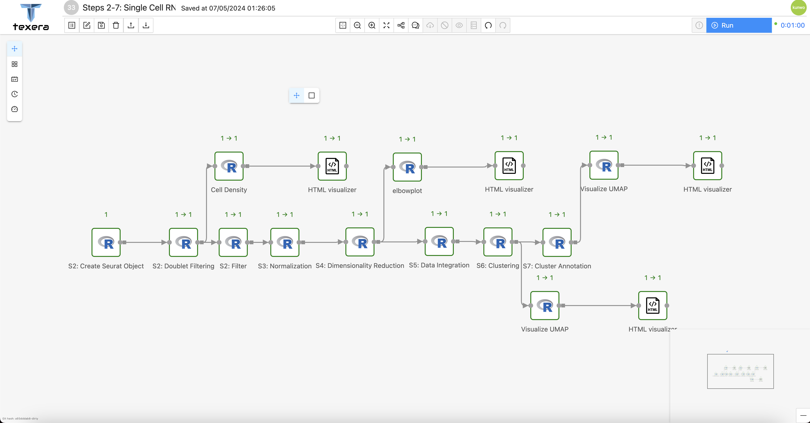
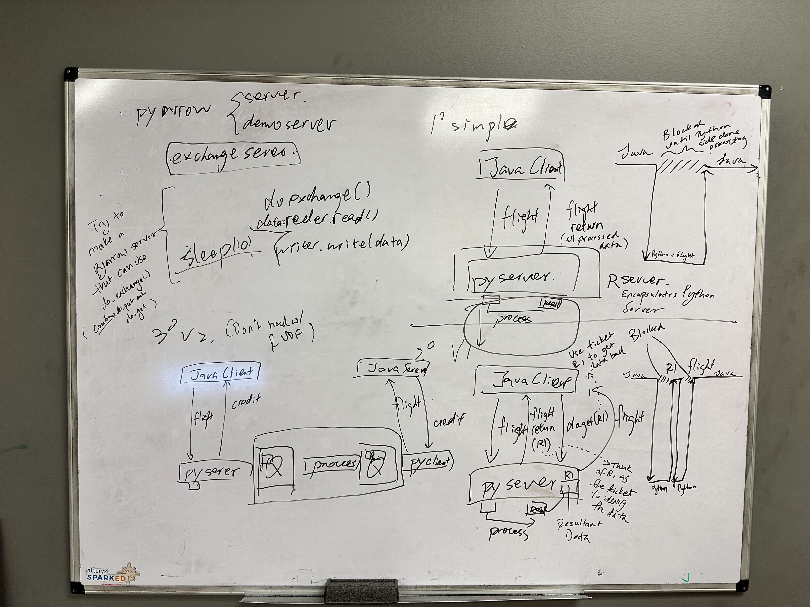
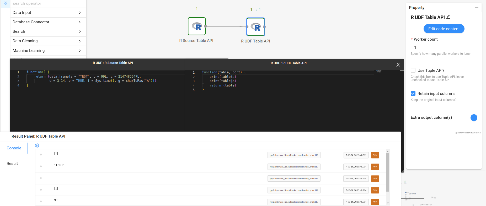
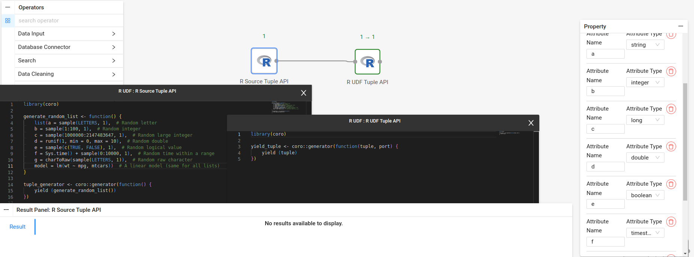

# Motivation

The R programming language is still a widely used language to this day. Users include statisticians, machine learning engineers, bioinformatics scientest, and many more use R in their applications.
Therefore, we wanted to allow a new set of users to use Texera with R, this way they may be able to incorporate Texera into their work.

Before this project, Texera was lacking well-defined support for the R programming language in its workflows.
Originally, Texera used Python UDFs and rpy2 to use R code in workflows, which proved to be an inelegant and non-robust solution. As a result, we decided to review the implementation of R into Texera with rpy2 and various other tools.
After finishing this project, we were able to cleanly support usage of R code in Texera and introduced writing R UDFs for both Table and Tuple API, similar to that of the Python UDFs.

Shown below in *Figure 1* is a sample workflow created by one of our users that exclusively uses R UDFs, all of which employed the Tuple API.
<figure style="margin: auto; text-align: center">

<figcaption align=center style="text-align:center; font-style: italic">Figure 1: A sample workflow using R UDFs only. All of the operators are using Tuple API</figcaption>
</figure>

# Initial Planning
## Arrow Flight and the Flight Server-Client Model
Originally, we wanted to use Arrow’s Flight module to write a native R Flight client-server model. This was due to the fact that a similar architecture with Arrow Flight existed for Python UDFs.
However, upon further research, we learned that R did not have a native and independent implementation of Arrow Flight.
Instead, R Arrow Flight works by calling methods taken from PyArrow Python. Because of this a few issues came up, the biggest being that only Python code could be used to edit anything that passed through the Flight server, rendering the purpose of R UDF useless.

As a result, this design had to be abandoned in favor of using only Arrow and `rpy2` (no Arrow Flight), which we learned would work out perfectly in our favor.
For context, `rpy2` is a Python library that allows a developer to write and run R code in an embedded session of R in Python.
As of writing this report, the Arrow R community has no plans to add an independent, native implementation of Arrow Flight.

Shown below in *Figure 2* was one of the various planning and working sessions we had together.

<figure style="margin: auto; text-align: center">

<figcaption align=center style="text-align:center; font-style: italic">Figure 2: One of the many planning sessions that we had together. This whiteboard shows the original objective of using Arrow Flight with R UDFs and how it fit in with the rest of Texera.
Eventually, this design was discarded in favor of using rpy2.</figcaption>
</figure>

# Challenges
Throughout this journey, we faced several challenges and blockers that we encountered when developing the general, overarching design of R UDF.

## Rpy2 and reticulate

`Reticulate` is an R package that allows the use of Python functions and methods inside an R session. In contrast, `rpy2` allows usage of R in Python. Back in 2018, someone from GitHub posted an issue saying that there was a compatibility issue with using rpy2 and reticulate at the same time.

The main issue was conflicting lock files between Python and R threads that did not allow `rpy2` and `reticulate` to be used at the same time. This was because either reticulate or rpy2 would lock the R thread and never allow the other to use it, putting each other into deadlock. This issue was eventually fixed in 2022, more can be seen here ([GitHub Issue](https://github.com/rstudio/reticulate/issues/208)).

## Rpy2 and Arrow (rpy2-arrow)

We had to determine a good way to bridge the gap between `R`, `Arrow`, and `rpy2`. We found out that the relatively new `rpy2-arrow` Python library (created around 2020) worked perfectly after some trial and error ([rpy2-arrow GitHub](https://github.com/rpy2/rpy2-arrow)). It was initially difficult to use, but worked out fine in the end.

A significant advantage `rpy2-arrow` provides is through the Arrow RPC framework, zero copy operations are done on Arrow data, everything exclusively uses pointers. This is great for performant results and was proven to be useful
when applying the final designs for both Table and Tuple APIs.

# Table API

## Challenges

- Bridging R Arrow to Python Arrow using `rpy2` and `rpy2-arrow`, we had to understand how the converter worked, especially in a multiple context system like Texera.
- The Table API does not work well for storing instances of advanced objects, and is instead best used for primitive types.
- We found that `data.frame` in R can store objects by first having the user manually serializing the object and then storing the object in the resulting Table. This is a very clunky solution and certainly not robust at all, especially since we have to rely on the user writing the serialization/deserialization code. We scrapped this design for the Tuple API after finding out these limitations.

## General Design/Solution

After lots of testing with R code and CSV data, our final design involved both Arrow Tables and R `data.frame`, utilizing rpy2-arrow’s `rarrow_to_py_table` function and its local conversion rules to facilitate the conversion. Essentially, the user will output an R data.frame (or something convertible to one) and the engine will convert that into an Arrow Table and pass it onto the next operator(s) for future use.
Due to the nature of rpy2-arrow and Arrow in general, performance is very fast since only C pointers are used, with zero copies created.

*Figure 3* below shows a very simple workflow that uses Table API.
<figure style="margin: auto; text-align: center">

<figcaption align=center style="text-align:center; font-style: italic">Figure 3: Sample showcase of Table API in Texera. Note the printed results matches that of the source Table, indicating a successful conversion from one operator to the next.</figcaption>
</figure>

# Tuple API

## Challenges

- Finding a good representation of a Tuple in R.
  - We first started with Arrow’s `StructArray` to represent a Tuple in R, but found out this had limitations, especially with dealing with binary/object data types.
  - It was a good theoretical start due to the performant nature of rpy2-arrow and Arrow datatypes and was included in the final design.
- Storing objects in R lists.
  - Initially thought we could not do it, but we found out you can store objects in R `List`, though the representation is a little complicated.
  - The main challenge was to replace Arrow StructArray with a manually constructed Python dictionary that could be translated to the R side via rpy2.
- Method on returning 0, 1, or more than 1 tuple.
  - After successfully returning 1 tuple through testing, we needed to expand to return 0, 1, or more than 1 tuple.
  - We discovered the R `coro` package, which allowed for Python-like generators to be written in R. We decided to use `coro` as a result.
  - This provides a more elegant way for users to write R UDFs, though it still has many limitations due to the rpy2 engine. Limitations include having to import the `coro` package in every UDF if you want to use Tuple API, and functions must be written within the generator (have to use anonymous/lambda function).

## General Design/Solution

As mentioned above, `coro` forms the backbone of the Tuple API design.
Users have to write their own generator function that will yield an R List, which is R’s representation of a Tuple. In the backend, we split the output Tuple from each opeartor into two parts.
One part contains the primitive types and allows us to continue using Arrow's `StructArray`,
the other part contains the binary objects that were serialized/deserialized and had to be manually converted on the backend.
We then combined the two separate parts together into the final Tuple, making sure to preserve column ordering and also support adding non-primitive objects in lists.

After adding Tuple API, we also added a toggle for R executors in order to allow users to choose between Table or Tuple API. Below in *Figure 4* is a very simple example workflow that uses Tuple API.
<figure style="margin: auto; text-align: center">

<figcaption align=center style="text-align:center; font-style: italic">Figure 3:
Sample showcase of Tuple API in Texera.
Notice how `library(coro)` is used in both executors. Also notice how in the UDF executor's code (the code in the middle), the function must be written as an anonymous function.</figcaption>
</figure>

# Conclusion/Final Design

This is a great start to introduce R UDF for Texera. Hopefully, this will unlock a new set of uses for Texera, which is always exciting to see happen. We wish that future improvments will be made by
other developers and we hope that our work and findings have been helpful in laying down the foundation for others.
