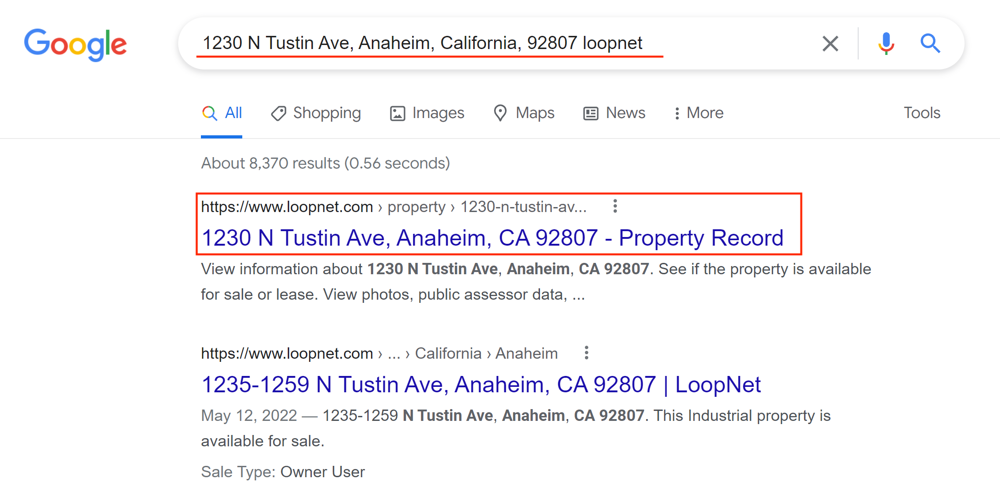

Crawling  is a common task, in this blog post, we'll go over an example task of crawling real estate data from Google and various real estate listing websites, such as

## Task Description

1. As a first step, we need to fetch the google search result of an real estate address
  <!--  -->
  
2. Parse the google search result to get the listing URL
2. Fetch the real estate listing website
3. Parse the listing HTML page and extract the corresponding information

## Pre-requisites
We'll be using Python 3 and the following Python libraries to perform the crawling and parsing tasks:
- [`requests`](https://requests.readthedocs.io/en/latest/) is a popular Python library to make HTTP requests in an elegant and simple way.
- [`BeautifulSoup`](https://beautiful-soup-4.readthedocs.io/en/latest/) is a Python library to parse and extract information from HTML pages.


## Step 1: Fetch and Analyze Google Search Results
In this step, we need to


```python
import requests
from bs4 import BeautifulSoup
import urllib.parse
address = "1045 S East St, Anaheim, California, 92805"
# address = "1230 N Tustin Ave, Anaheim, California, 92807"
# address = "1000 S Meridian Ave, Alhambra, California, 91803"
googleQuery = "http://google.com/search?q=" + urllib.parse.quote(address+ " loopnet")
googlePage = requests.get(googleQuery)
soup = BeautifulSoup(googlePage.text, 'html.parser')
result = soup.find_all('a', href=True)
loopnetUrls = [r for r in result if "loopnet.com" in r['href']]
loopnetUrlRaw = loopnetUrls[0]['href']
loopnetUrl = loopnetUrlRaw[loopnetUrlRaw.find("http"): loopnetUrlRaw.rfind("/")]


loopnetPage = requests.get(loopnetUrl, headers={"User-Agent": "Mozilla/5.0 (platform; rv:geckoversion) Gecko/geckotrail Firefox/firefoxversion"})
soup = BeautifulSoup(loopnetPage.text, 'html.parser')

notAdvertised = "no longer being advertised on LoopNet.com" in loopnetPage.text
kv = {}
website_address = ""

if notAdvertised:
    propertyData = soup.find(class_="property-data").find_all("td")
    kv[propertyData[0].text.strip()] = propertyData[1].text.strip()
    kv[propertyData[2].text.strip()] = propertyData[3].text.strip()
    kv[propertyData[4].text.strip()] = propertyData[5].text.strip()
    kv[propertyData[6].text.strip()] = propertyData[7].text.strip()
    addressStr = soup.find(text="Address: ").parent.parent.text
    website_address = addressStr[len("Address:"):].strip()
else:
    assessments = soup.find_all(class_="assessment-key")
    for node in assessments:
        key = node.findChildren()[0].text.strip()
        value = node.parent.findChildren()[2].text.strip()
        kv[key] = value
    website_address = kv["Address"]
```
