## Motivation
Data-processing workflows are directed acyclic graphs consisting of operators and links. Many machine learning (ML) platforms have fostered  communities that contribute a wealth of workflow templates and examples. These resources are invaluable for learning, research, and practical application. To make them accessible to Texera users, we have developed a workflow converter so that users can easily parse and translate third-party workflows to Texera's workflows. The translated workflows can also expand Texera's workflow repository, which can facilitate the process of building a community for Texera and developing AI-based workflow recommendation algorithms. The following is an example workflow in the original format and the converted workflow in Texera:

<figure style="margin: auto; text-align: center">
<a>
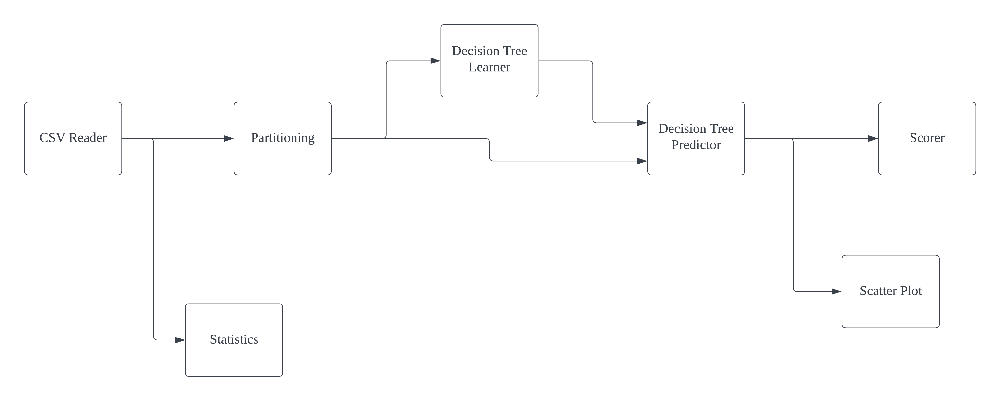
</a>
<figcaption align = "center"><i>Figure 1: Before conversion</i></figcaption>
</figure>

<figure style="margin: auto; text-align: center">
<a>
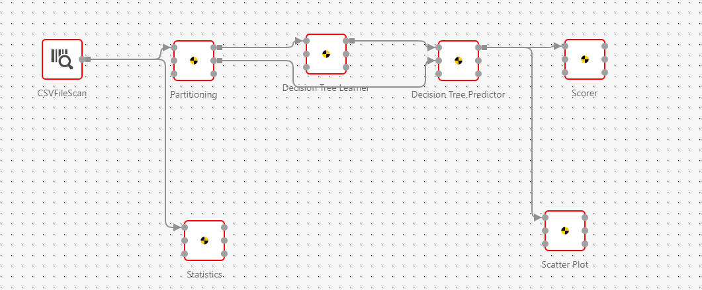
</a>
<figcaption align = "center"><i>Figure 2: After conversion</i></figcaption>
</figure>

## Challenges
We faced server challenges during this project.  First the workflow parser needs to be general enough to handle wide differences between ML platforms. Each ML platform has its unique ways of describing workflow metadata. Developing a parser tailored to each specific platform can be labor-intensive and challenging to sustain over time. Therefore, we want a universal parser. The diversity in workflow structures complicates the task of a universal parser to efficiently extract the necessary workflow information.

<figure style="margin: auto; text-align: center">
<a>
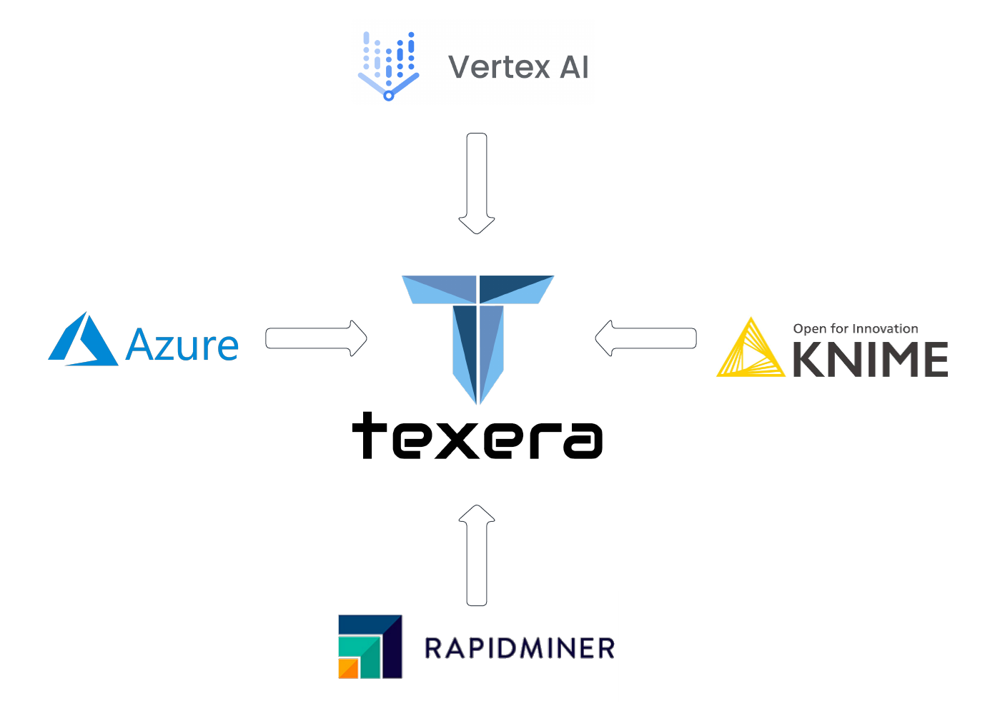
</a>
<figcaption align=center style="text-align:center; font-style: italic">Figure 3: The diversity of ML platforms complicates the task of general workflow parser</figcaption>
</figure>

In addition, various third-party ML platforms have their unique operators reflecting different design philosophies and distinct emphases on the machine learning user experience. These specialized operators, while reflective of each platform's unique strengths, introduce complexities in developing direct mappings between Texera's operators and those from other platforms. More often than not there won't be a direct mapping from a third-party operator to a Texera's operator. In many cases, there is straightforward correspondence between operators across platforms. For operators without an existing counterpart in Texera, we must find a way to substitute it with a certain Texera operator so that we can preserve the original workflow structure. Even in scenarios where an operator from a third-party platform can be mapped to Texera, the challenge persists in translating operator properties. Besides dealing with the complex mapping relationships, we also need to make extra efforts to prepare the retrieved property value for the Texera platform.

<figure style="margin: auto; text-align: center">
<a>
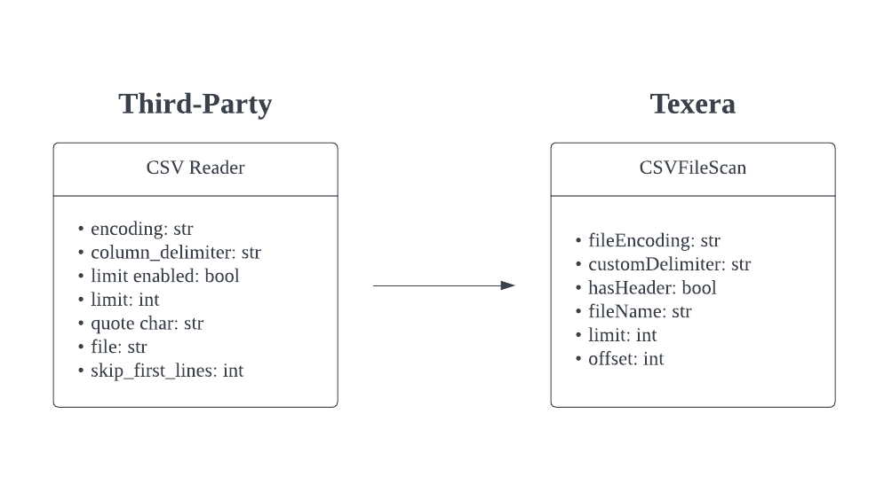
</a>
<figcaption align=center style="text-align:center; font-style: italic">Figure 4: An example mapping from a third-party operator to its Texera counterpart </figcaption>
</figure>

## Solution

Most workflow-based platforms use either XML or JSON formats to encapsulate their workflow metadata. Given that both formats inherently structure data in a tree-like manner, the challenge shifts towards identifying and manipulating specific nodes within one tree to transform it into a tree structure compatible with Texera, which we ultimately export as a JSON file. Thus we treat the third-party workflow as a tree and perform a node-based parsing. Though the metadata might differ in their formats, their hierarchical structure is invariant.

<figure style="margin: auto; text-align: center">
<a>
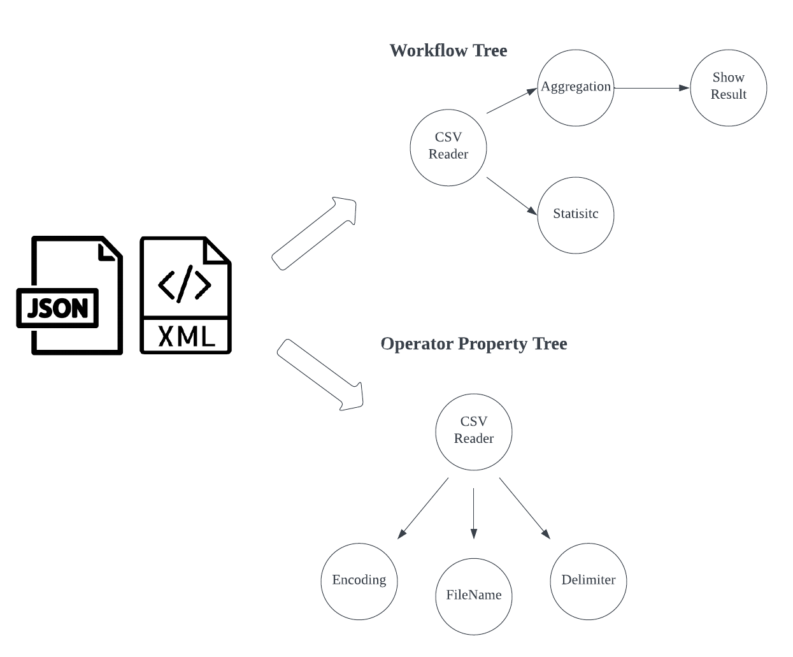
</a>
<figcaption align=center style="text-align:center; font-style: italic">Figure 5: JSON or XML metadata files treated as trees</figcaption>
</figure>

### Two-way Mapping Relationship
A workflow conversion comprises two parts:
* A complete mapping of the topological structure of the original workflow
* A partial mapping of a property of an operator of the Texera workflow to properties of the corresponding operator of the original workflow

To preserve the topological structure, we traverse through the input workflow tree, retrieve the desired nodes, and populate the corresponding sections in the Texera tree. The mapping direction of this part is "Third-party workflow -> Texera workflow."

<figure style="margin: auto; text-align: center">
<a>
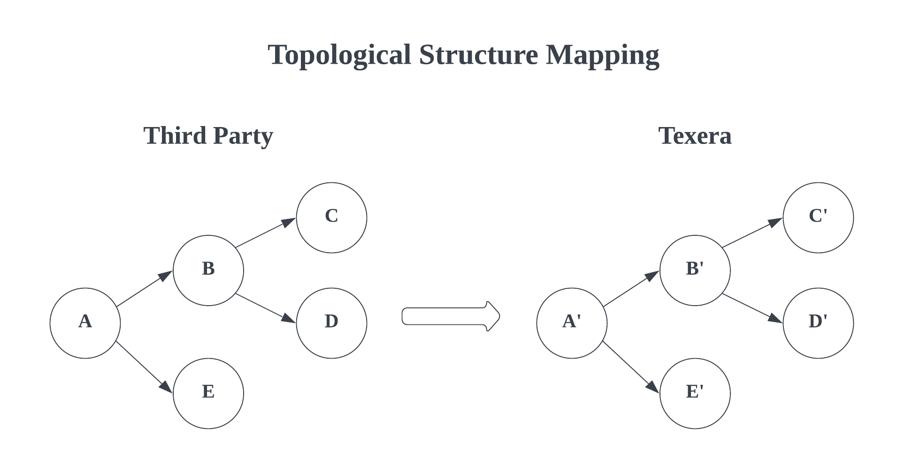
</a>
<figcaption align=center style="text-align:center; font-style: italic">Figure 6: Topological Structure Mapping Illustration</figcaption>
</figure>

To map the properties of each operator, things are quite tricky.  We are only interested in the operator properties that exist in the target Texera workflow.  We loop through the property tree for each Texera operator, and extract the corresponding property nodes from the  property tree of the original operator. The mapping direction of this part: "Texera operator properties -> Third-party operator properties.

<figure style="margin: auto; text-align: center">

<figcaption align=center style="text-align:center; font-style: italic">Figure 7: Property Mapping Illustration</figcaption>
</figure>

### Support for Unknown Operators/Properties
A dummy operator is introduced in Texera to preserve the DAG structure of a workflow when translating operators from a third-party platform to Texera. It acts as a placeholder in scenarios where operators present in a third-party workflow aren't present in Texera, or where translation isn't one-to-one.

<figure style="width: 30%; margin: auto; text-align: center">
<a>
  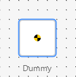
</a>
<figcaption align=center style="text-align:center; font-style: italic">Figure 8: Dummy Operator</figcaption>
</figure>

Some third-party operators have properties not present in Texera, and it is desirable to preserve the properties and their values, even if there isn't a corresponding property in Texera. For this purpose, we introduced dummy properties to preserve information about such operators during translation.

<figure style="width: 50%; margin: auto;">
<a>
  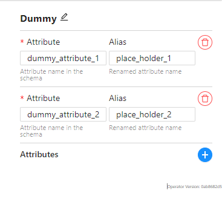
</a>
<figcaption align=center style="text-align:center; font-style: italic">Figure 9: Dummy Properties</figcaption>
</figure>

## Final product
The workflow parser takes in a third-party workflow's metadata and translates it into a Texera workflow JSON file according to the mapping configuration file (mapping_config.yaml) Every source operator that has a counterpart in Texera would need an instance inside the configuration file for the parser to work properly. The dummy operator is a placeholder operator disabled by default for users. If enabled by a developer, it is read-only, and should only come from the workflow parser's output. It supports multiple input and output edges, but cannot be executed. A dummy property is a placeholder property with two fields: a title and a description. Dummy properties are also disabled by default. If enabled by a developer, every Texera operator, including the dummy operator, gains access to a list of dummy properties as one of its properties, where unimplemented properties or missing features can be described by adding dummy properties as needed.

## Demonstrations

<figure>
<a href="https://youtu.be/Tfndk0k30LA">
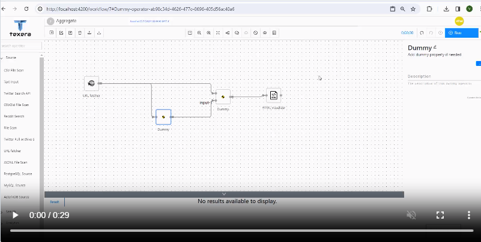
</a>
<figcaption align = "center"><i>Dummy Operator Demo</i></figcaption>
</figure>

<figure>
<a href="https://youtu.be/qQCL1xxGrLk">
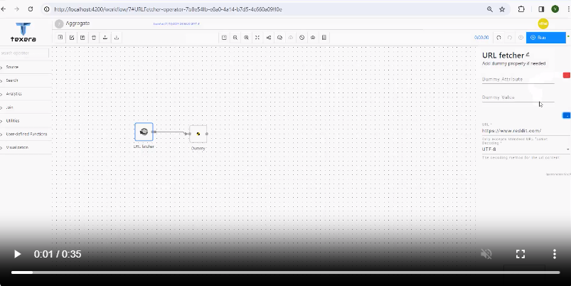
</a>
<figcaption align = "center"><i>Dummy Property Demo</i></figcaption>
</figure>

<figure>
<a href="https://www.youtube.com/watch?v=Ekmnq5E8sIs">
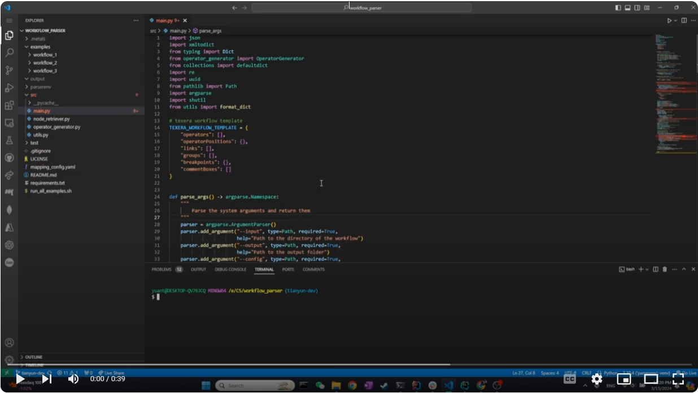
</a>
<figcaption align = "center"><i>Workflow Parser Demo</i></figcaption>
</figure>
